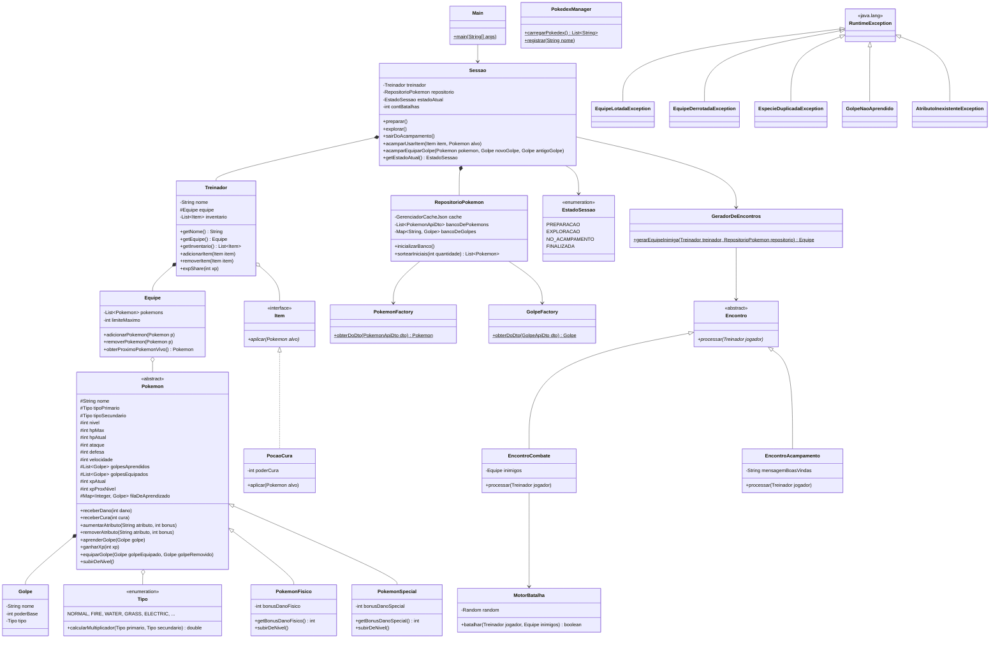

# POOke - Simulador de Batalhas CLI

POOke é um simulador de batalhas Pokémon totalmente desenvolvido em Java, rodando diretamente no terminal (CLI). O jogo traz mecânicas da franquia original, como fraquezas e resistências baseadas em tipos, aumento de status por nível, sistema de aprendizado dinâmico de golpes, e sistema de mochila com itens consumíveis, além da persistência de uma Pokédex local!

## 📌 Funcionalidades
- **Sistema de Batalha em Turnos:** Lute contra equipes selvagens geradas proceduralmente.
- **Vantagem de Tipos:** Multiplicadores reais de STAB e Fraqueza/Resistência.
- **Gerenciamento de Equipe:** Mantenha até 6 Pokémons, substitua membros ao capturar novos e monitore a vida de todos.
- **Progresso de Nível:** Pokémons ganham experiência, sobem de nível, melhoram seus atributos e aprendem novos golpes!
- **Pokédex Persistente:** O progresso de capturas é salvo em um arquivo local (`pokedex.txt`), mantendo seu legado entre diferentes sessões.
- **Banco de Dados Local:** Utiliza cache JSON com base na API oficial (PokéAPI) para carregar atributos balanceados.

## 🚀 Como Executar o Jogo

O POOke foi desenhado para ser compilado e executado em qualquer ambiente que possua o **Java 17+** (ou superior) instalado.

### Opção 1: Usando uma IDE (Eclipse, IntelliJ, VS Code)
1. Importe a pasta do projeto como um **Projeto Maven**.
2. Aguarde a IDE baixar as dependências do `pom.xml`.
3. Localize o arquivo `Main.java` (em `src/main/java/com/pooke/Main.java`).
4. Execute o método `main()`.

### Opção 2: Compilando no Terminal (Maven)
Se você não possui uma IDE e quer compilar pelo terminal puro, basta ter o [Apache Maven](https://maven.apache.org/) e o JDK 17 instalados:

1. Abra o terminal na raiz do projeto (onde está o arquivo `pom.xml`).
2. Limpe a build e compile o projeto:
   ```bash
   mvn clean compile 
   ```
3. Execute o jogo usando o plugin do maven:
   ```bash
   mvn exec:java -D"exec.mainClass"="com.pooke.Main"
   ```

### Opção 3: Gerando um Executável (Fat JAR)
Se desejar gerar um arquivo `.jar` fechado para distribuir para amigos que não são programadores:
1. Compile e empacote o projeto através do Maven:
   ```bash
   mvn clean package
   ```
2. Um arquivo `.jar` será gerado na pasta `target` (ex: `POOke-0.0.1-SNAPSHOT-jar-with-dependencies.jar`).
3. Para rodar, mova esse `.jar` para perto da pasta `/data/` e execute:
   ```bash
   java -jar target/POOke-0.0.1-SNAPSHOT-jar-with-dependencies.jar
   ```

## 🛠 Arquitetura do Projeto
O projeto utiliza conceitos de **Programação Orientada a Objetos**, satisfazendo:
- **Polimorfismo e Herança:** Diferenciação de evolução de status através de `PokemonFisico` e `PokemonSpecial`, e sistema de eventos de mapa polimórficos (`EncontroCombate`).
- **Encapsulamento e Regras de Negócio:** Fórmulas de dano, limite de golpes e validação de captura todas encapsuladas no Domínio.
- **Tratamento de Exceções:** Custom Exceptions como `EquipeLotadaException` guiando o fluxo do jogo e prevenindo crashs abruptos.
- **Manipulação de Arquivos (Save State):** Serialização com o `PokedexManager` gerenciando a E/S (I/O) de forma limpa.

### Diagrama de Classes UML (Completo)
